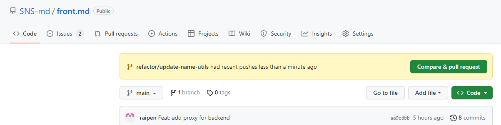

# 1. 실행방법
0. git, node.js 설치
1. 프로젝트 다운로드
    ```bash
    $ git clone https://github.com/SNS-md/front.md.git
    ```
2. 프로젝트 폴더로 이동
    ```bash
    $ cd front.md
    ```
3. 패키지 설치 및 실행
    ```bash
    $ npm install
    $ npm start
    ```
# 2. 기여하는 방법
1. 해결할 이슈 선택 or 새로운 이슈 생성
2. 이슈에 대한 브랜치 생성
    ```bash
    $ git checkout -b <branch_name>
    ```
3. 브랜치에서 작업 후 커밋
    ```bash
    $ git add .
    $ git commit -m "<commit_message>"
    ```
    * 커밋 메시지는 내용 알아볼 수만 있도록 알잘딱하게 진행해주세요(미니 프로젝트니 너무 부담갖지 말고 간단하게 적으셔도 됩니다!)
4. 브랜치를 깃허브에 푸시
    ```bash
    $ git push origin <branch_name>
    ```
5. 깃허브에서 Pull Request 생성
    
6. 코드 리뷰 후 main branch에 Merge
    * 6번 항목은 직접하지 않으셔도 됩니다. 5번 PR까지 완료하시면 다른 분들이 코드 리뷰 후 Merge해드립니다.
    * 물론 자신이 직접 코드 리뷰를 하고 Merge해도 좋습니다.(미니프로젝트니까요)
    * 편하게 서로 코드 리뷰 요청해도 좋습니다!!
    * 가능하면 Squash and Merge로 Merge해주세요. (최종적으로 main에는 해당 브랜치 내용이 하나의 커밋으로 남도록 합쳐주는 기능입니다.)
    * Merge 후에는 브랜치를 삭제해주세요.